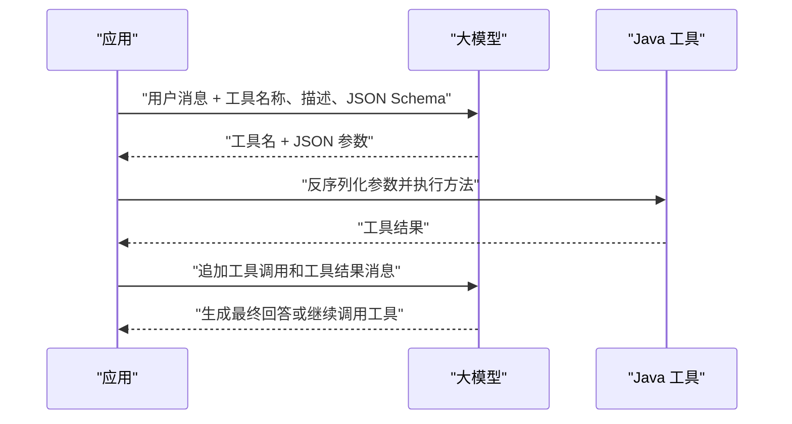
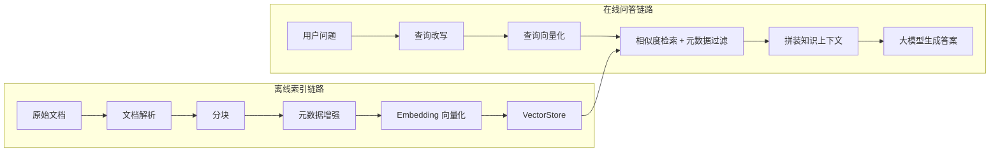
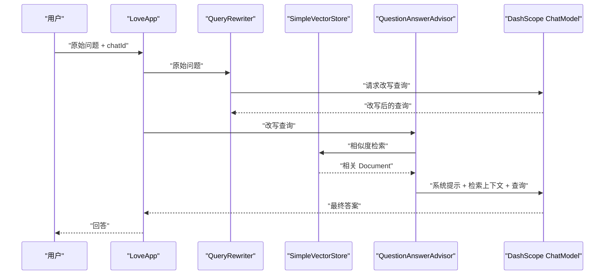

# LangChain4j 关键技术与本项目 RAG 实现

## 1. 项目中的框架定位

本项目同时引入了 LangChain4j、Spring AI 和 Spring AI Alibaba，但三者承担的角色并不相同：

| 技术 | 本项目中的用途 | 当前使用程度 |
| --- | --- | --- |
| LangChain4j | 通过 `QwenChatModel` 演示直接调用通义千问b (调用) | 仅用于独立 Demo |
| Spring AI | `ChatClient`、对话记忆、结构化输出、工具调用、RAG、向量库 （） | 核心业务框架 |
| Spring AI Alibaba | DashScope 模型适配、阿里云知识库检索 | 模型和云服务适配 |

LangChain4j 的入口位于：

```text
src/main/java/com/xiaoguo/guaiagent/demo/invoke/LangChainAiInvoke.java
```

项目核心业务位于：

```text
src/main/java/com/xiaoguo/guaiagent/app/LoveApp.java
src/main/java/com/xiaoguo/guaiagent/agent/
src/main/java/com/xiaoguo/guaiagent/rag/
```

因此，理解该项目时不能把所有 AI 功能都归为 LangChain4j。LangChain4j 提供了一个模型直调示例，完整应用链路实际采用 Spring AI 实现。

## 2. LangChain4j 的几个重要技术实现

### 2.1 统一模型抽象和供应商适配

LangChain4j 最基础的设计是用统一接口屏蔽不同模型供应商的协议差异。项目使用的依赖为：

```xml
<dependency>
    <groupId>dev.langchain4j</groupId>
    <artifactId>langchain4j-community-dashscope</artifactId>
    <version>1.0.0-beta2</version>
</dependency>
```

代码通过 `ChatLanguageModel` 接口使用 DashScope 实现：

```java
ChatLanguageModel qwenChatModel = QwenChatModel.builder()
        .apiKey(apiKey)
        .modelName("qwen-max")
        .build();

String answer = qwenChatModel.chat("你好");
```

这里包含两层关键抽象：

1. `ChatLanguageModel` 定义统一的对话模型能力。
2. `QwenChatModel` 将统一调用转换为 DashScope 所需的 HTTP 请求和响应。

业务代码依赖抽象接口，而不是供应商 SDK。更换模型时通常只需替换模型实现及配置，调用层可以保持稳定。

### 2.2 Builder 配置与不可变模型客户端

LangChain4j 的模型实例通常通过 Builder 创建。Builder 负责收集 API Key、模型名、超时时间、重试、温度等参数，最终构造可复用的模型客户端。

这种模式有两个重要作用：

- 将复杂配置集中在对象创建阶段，避免每次请求重复拼装参数。
- 模型对象构建完成后可以作为单例复用，适合由 Spring 容器管理。

生产项目中不应像 Demo 一样在业务方法中反复创建模型，也不应把 API Key 写死在 Java 文件里。应通过环境变量或配置中心注入。

### 2.3 消息模型与多轮对话

大模型调用并不只是一个字符串请求。完整会话通常由多种消息组成：

- System Message：定义模型角色和行为边界。
- User Message：用户本轮输入。
- AI Message：模型历史回答，可能携带工具调用信息。
- Tool Execution Result Message：工具执行结果。

多轮对话的本质，是每次请求都按正确顺序提交相关历史消息。LangChain4j 的 Chat Memory 会在调用前取出历史消息，在调用后保存用户和 AI 消息，并依据窗口大小淘汰旧消息。

需要注意：聊天记忆解决的是“会话上下文”，RAG 解决的是“外部知识检索”，两者不是同一个概念。

### 2.4 AI Services：声明式代理

LangChain4j 的代表性能力之一是 AI Services。开发者定义 Java 接口和提示词，框架通过动态代理完成：

1. 参数绑定和 Prompt 渲染。
2. Chat Memory 加载。
3. 工具定义注册。
4. 模型调用。
5. 返回值解析和结构化映射。

示意代码如下：

```java
interface Assistant {
    String chat(String message);
}

Assistant assistant = AiServices.builder(Assistant.class)
        .chatLanguageModel(chatLanguageModel)
        .build();
```

这种方式适合接口明确、调用链固定的业务服务。需要精细控制每一步消息、工具执行和 Agent 状态时，则更适合直接调用底层模型接口。

### 2.5 Tool Calling 的两阶段机制

工具调用不是模型直接执行 Java 方法，而是两个阶段：



关键点包括：

- 工具描述决定模型何时选择工具。
- 参数 Schema 决定模型生成的参数是否能被 Java 方法接收。
- 工具执行结果必须和对应的工具调用 ID 正确关联。
- 必须限制工具权限、参数范围、超时和返回内容长度。

本项目的工具调用实际采用 Spring AI `ToolCallback[]`。已经转换成 `ToolCallback` 的工具应通过 `.toolCallbacks(...)` 注册，不能再次传给 `.tools(...)` 扫描，否则会出现：

```text
No @Tool annotated methods found in MethodToolCallback
```

### 2.6 结构化输出

结构化输出的目标是把模型文本转换为稳定的 Java 类型。常见实现过程是：

1. 根据 Java 类型生成 JSON Schema 或格式说明。
2. 把格式约束加入 Prompt 或模型参数。
3. 获取模型输出。
4. 解析为 Java 对象，并处理格式异常。

本项目在 `LoveApp` 中使用 Spring AI 的等价能力：

```java
LoveReport report = chatClient.prompt()
        .user(message)
        .call()
        .entity(LoveReport.class);
```

结构化输出适合报告、分类、信息抽取和 API 参数生成。生产环境仍需进行字段校验，因为模型输出并不天然可信。

### 2.7 流式输出

同步调用需要等待完整响应；流式调用会持续返回 Token 或文本片段。LangChain4j 和 Spring AI 都支持流式模型抽象。

本项目使用 Spring AI Reactor 流：

```java
Flux<String> content = chatClient.prompt()
        .user(message)
        .stream()
        .content();
```

流式链路需要额外处理：客户端取消、网络断开、超时、背压、异常终止和 SSE 生命周期。日志中的 `onErrorDropped` 往往只是订阅链没有消费异常的后续表现，应继续查看它之前的原始异常。

## 3. RAG 的核心原理

RAG（Retrieval-Augmented Generation，检索增强生成）把“从知识库找资料”和“让大模型组织答案”组合起来，避免只依赖模型训练时的静态知识。

一个完整的 RAG 系统分为离线索引和在线问答两条链路。



RAG 的效果主要取决于三个环节：

- 索引质量：文档是否被正确解析、分块和标注。
- 检索质量：Embedding、过滤条件、TopK 和阈值是否合理。
- 生成约束：Prompt 是否要求模型只依据检索上下文作答。

## 4. 本项目的 RAG 实现

### 4.1 文档加载

`LoveAppDocumentLoader` 从以下路径批量加载 Markdown：

```text
classpath:document/*.md
```

它使用 `MarkdownDocumentReader` 解析文件，并设置：

```java
MarkdownDocumentReaderConfig.builder()
        .withHorizontalRuleCreateDocument(true)
        .withIncludeCodeBlock(false)
        .withIncludeBlockquote(false)
        .withAdditionalMetadata("filename", filename)
        .withAdditionalMetadata("status", status)
        .build();
```

实现要点：

- Markdown 水平分隔线可以形成独立 Document。
- 代码块和引用块被排除，减少不相关内容。
- `filename` 用于追踪来源。
- `status` 表示“单身、恋爱、已婚”等业务分类，后续可以用于元数据过滤。

当前 `status` 通过文件名固定位置截取，依赖命名格式。更稳健的做法是使用明确的文件名规则、Markdown Front Matter，或维护文档元数据清单。

### 4.2 文档分块

`MyTokenTextSplitter` 提供两种方式：

```java
new TokenTextSplitter();
```

以及自定义配置：

```java
new TokenTextSplitter(200, 100, 10, 5000, true);
```

分块需要平衡：

- 块太大：检索结果包含过多噪声，并占用更多上下文 Token。
- 块太小：语义被切断，检索到的内容缺少完整事实。
- 适度重叠：可以保护跨分块边界的语义，但会增加索引量。

当前 `LoveAppVectorStoreConfig` 中自定义分块代码被注释，实际直接对 Markdown Reader 生成的 Document 做关键词增强和向量化。因此当前粒度主要由 Markdown 解析结果决定，并没有应用 `splitCustomized`。

### 4.3 关键词元数据增强

`MyKeywordEnricher` 使用模型为每个文档生成 5 个关键词：

```java
KeywordMetadataEnricher enricher =
        new KeywordMetadataEnricher(dashscopeChatModel, 5);
return enricher.apply(documents);
```

关键词可以改善文档描述和后续过滤，但这里会在知识库初始化时调用远程大模型，存在三个影响：

- 启动速度依赖网络和文档数量。
- 每次重新初始化可能重复消耗模型额度。
- 配额或网络异常可能导致 Bean 创建失败。

更可靠的生产实现是把文档解析、分块、关键词生成和入库做成独立的离线任务；应用启动只连接已经构建好的向量库。

### 4.4 Embedding 与内存向量库

`LoveAppVectorStoreConfig` 当前构建 `SimpleVectorStore`：

```java
SimpleVectorStore store = SimpleVectorStore.builder(embeddingModel).build();
List<Document> documents = documentLoader.loadMarkdowns();
List<Document> enriched = keywordEnricher.enrichDocuments(documents);
store.add(enriched);
```

`store.add(...)` 内部会调用 Embedding Model，把每个文档文本转换成浮点向量并保存。查询时，用户问题也会用同一个 Embedding Model 转成向量，然后计算相似度。

`SimpleVectorStore` 适合 Demo 和本地开发，但索引通常在进程内存中：

- 重启后需要重新构建。
- 不适合大规模文档。
- 不适合多实例共享。
- 初始化时会产生远程 Embedding 调用。

### 4.5 查询改写

`QueryRewriter` 使用 `RewriteQueryTransformer` 将原始问题改写为更适合检索的独立查询：

```java
Query query = new Query(prompt);
Query transformed = queryTransformer.transform(query);
return transformed.text();
```

例如，会话中的“那结婚后呢？”脱离历史上下文时不适合直接检索。查询改写可以将它变成“结婚后如何处理夫妻沟通问题”一类完整问题。

查询改写会额外调用一次大模型。应通过离线评测判断它是否真正提升召回率，不应默认认为增加模型步骤一定更好。

### 4.6 检索与 Prompt 增强

`LoveApp.doChatWithRag` 当前使用：

```java
String rewritten = queryRewriter.doQueryRewrite(message);

chatClient.prompt()
        .user(rewritten)
        .advisors(new QuestionAnswerAdvisor(loveAppVectorStore))
        .call();
```

`QuestionAnswerAdvisor` 的职责可以概括为：

1. 根据查询从 `VectorStore` 搜索相关文档。
2. 把检索结果作为上下文加入模型 Prompt。
3. 调用 Chat Model 生成最终答案。

注意：当前实现把“改写后的查询”同时作为检索查询和最终用户问题。更完善的设计通常保留原始问题用于最终回答，只把改写结果用于检索，防止改写过程中损失用户表达或业务约束。

### 4.7 自定义检索器

`LoveAppRagCustomAdvisorFactory` 展示了更细粒度的检索控制：

```java
Filter.Expression filter = new FilterExpressionBuilder()
        .eq("status", status)
        .build();

DocumentRetriever retriever = VectorStoreDocumentRetriever.builder()
        .vectorStore(vectorStore)
        .filterExpression(filter)
        .similarityThreshold(0.5)
        .topK(3)
        .build();
```

三个关键参数分别是：

| 参数 | 作用 | 调整影响 |
| --- | --- | --- |
| `status` 过滤 | 只检索指定业务分类 | 提高精度，但分类错误会损失召回 |
| `similarityThreshold(0.5)` | 排除低相关文档 | 越高越严格，可能无结果 |
| `topK(3)` | 最多返回 3 个文档块 | 越大上下文越丰富，但噪声和 Token 更多 |

随后通过 `RetrievalAugmentationAdvisor` 将检索器与 `ContextualQueryAugmenter` 组合。当没有上下文时，项目配置为拒绝回答非恋爱领域问题，而不是让模型凭自身知识继续生成。

### 4.8 PgVector 持久化方案

`PgVectorVectorStoreConfig` 提供 PostgreSQL + pgvector 的实现：

```java
PgVectorStore.builder(jdbcTemplate, embeddingModel)
        .dimensions(1536)
        .distanceType(COSINE_DISTANCE)
        .indexType(HNSW)
        .initializeSchema(true)
        .schemaName("public")
        .vectorTableName("vector_store")
        .maxDocumentBatchSize(10000)
        .build();
```

其中：

- `dimensions` 必须与 Embedding 模型输出维度一致。
- `COSINE_DISTANCE` 适用于主要比较向量方向的文本相似度。
- `HNSW` 是近似最近邻索引，用更多内存换取较快查询。
- `initializeSchema(true)` 会尝试自动初始化表结构。

当前这个配置类的 `@Configuration` 被注释，主应用也排除了 `DataSourceAutoConfiguration`，所以 PgVector 不是当前默认生效的向量库。要启用它，必须同时恢复数据源自动配置、启用该配置类，并确认向量维度与实际 Embedding 模型一致。

### 4.9 阿里云知识库方案

项目还提供 `DashScopeDocumentRetriever`：

```java
DocumentRetriever retriever = new DashScopeDocumentRetriever(
        dashScopeApi,
        DashScopeDocumentRetrieverOptions.builder()
                .withIndexName(knowledgeIndex)
                .build()
);
```

它把文档存储和召回交给阿里云知识库，应用只负责调用检索器并增强 Prompt。优点是减少本地索引维护，缺点是增加外部服务依赖、调用成本和网络延迟。

## 5. 当前 RAG 请求时序



## 6. 生产化改进重点

### 6.1 将索引构建与应用启动解耦

当前内存向量库初始化会调用关键词模型和 Embedding 服务。建议改为：

```text
文档变化 -> 独立索引任务 -> 持久化 VectorStore -> 应用只做在线检索
```

这样模型配额或网络短暂异常不会阻止 Web 服务启动。

### 6.2 建立 RAG 评测集

至少记录以下指标：

- Recall@K：正确资料是否出现在前 K 个结果中。
- MRR：第一个正确结果的排名。
- Context Precision：召回内容中真正相关内容的比例。
- Answer Faithfulness：回答是否能被检索上下文支持。
- 无答案准确率：知识库没有答案时能否正确拒答。

`topK`、阈值、分块大小和查询改写策略都应根据评测结果调整。

### 6.3 保留来源信息

当前文档已经带有 `filename` 元数据。最终回答可以返回引用来源，便于用户验证，也便于排查错误召回。

### 6.4 做增量索引和内容去重

不应每次全量重新向量化。可为文档块计算内容哈希：

- 哈希未变化：复用已有向量。
- 新增或修改：重新生成向量并 Upsert。
- 删除：从向量库删除对应记录。

### 6.5 控制安全边界

外部文档内容不能被默认视为可信指令。应防止文档中的 Prompt Injection 覆盖系统提示，并限制检索内容触发终端、文件写入等高权限工具。

## 7. 代码索引

| 主题 | 文件 |
| --- | --- |
| LangChain4j 模型直调 | `demo/invoke/LangChainAiInvoke.java` |
| 对话、记忆、结构化输出、RAG 调用 | `app/LoveApp.java` |
| Markdown 文档加载 | `rag/LoveAppDocumentLoader.java` |
| Token 分块 | `rag/MyTokenTextSplitter.java` |
| AI 关键词增强 | `rag/MyKeywordEnricher.java` |
| 查询改写 | `rag/QueryRewriter.java` |
| 内存向量库 | `rag/LoveAppVectorStoreConfig.java` |
| PgVector | `rag/PgVectorVectorStoreConfig.java` |
| 自定义检索参数 | `rag/LoveAppRagCustomAdvisorFactory.java` |
| 空上下文处理 | `rag/LoveAppContextualQueryAugmenterFactory.java` |
| 阿里云知识库 | `rag/LoveAppRagCloudAdvisorConfig.java` |

## 8. 总结

LangChain4j 的核心价值是通过统一模型接口、AI Services、Chat Memory、Tool Calling、结构化输出和 RAG 组件降低 Java AI 应用的开发成本。本项目目前只使用了它的 DashScope 模型直调能力。

本项目真正的 RAG 主线由 Spring AI 实现：Markdown 文档加载后经过可选分块和关键词增强，通过 DashScope Embedding 写入 `SimpleVectorStore`；在线请求先进行查询改写，再由 `QuestionAnswerAdvisor` 检索并增强 Prompt，最后调用 Chat Model 生成答案。此外，项目预留了自定义过滤检索、PgVector 和阿里云知识库三种扩展方案。
