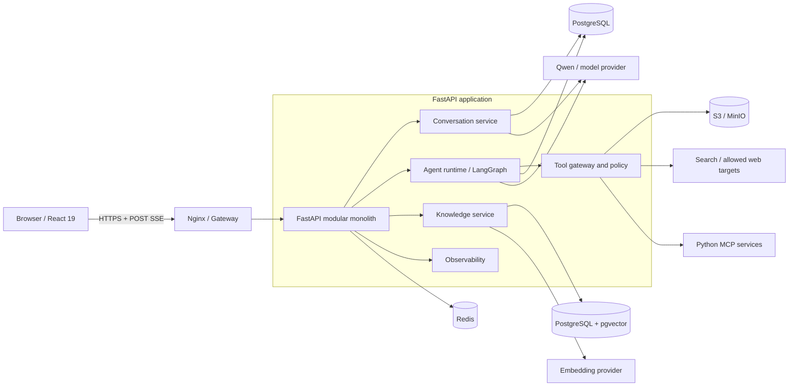

# AI Agent Python + React 19 重构规格

> 状态：Draft v0.1  
> 日期：2026-08-26  
> 参考仓库：[carryxiaoguo/ai-agent](https://github.com/carryxiaoguo/ai-agent)  
> 目标：将现有 Java 21 + Spring AI + Vue 3 项目重构为 Python + React 19，并建立可上线的安全、测试和运维基线。

## 1. 摘要

本次重构保留现有项目的普通 AI 对话、多轮记忆、RAG、工具调用、MCP 和 ReAct 智能体能力。后端改为 Python 3.11 + FastAPI，前端改为 React 19 + TypeScript，并以统一的 REST/SSE 协议连接。

重构不采用逐文件翻译。实施原则是先固化外部行为，再按功能切片替换，并在切换前通过契约测试、AI 评测、安全测试和性能测试。


## 2. 背景

现有仓库是一个教学型 AI 应用，主要包含：

- AI 恋爱顾问：普通对话、多轮记忆、结构化输出、RAG、工具和 MCP 示例。
- YuManus 智能体：基于 ReAct 的思考、工具调用和终止循环，最多执行 20 步。
- 工具：文件读写、网页搜索、网页抓取、资源下载、终端命令、PDF 生成和主动终止。
- 独立图片搜索 MCP 服务。
- Vue 3 聊天页面以及 Spring Boot SSE 接口。

当前代码可以构建，但仍有以下产品化缺口：

- 对外接口只覆盖普通对话和 Manus，RAG、工具、MCP 多数停留在代码示例层。
- 会话由浏览器随机生成 ID，消息默认保存在单进程内存，无法可靠隔离用户和跨实例恢复。
- SSE 没有统一事件结构。前端等待 `[DONE]`，服务端并未在所有路径显式发送该标记。
- 没有身份识别和限流，CORS 允许任意来源携带凭据。
- 终端、文件、下载和抓取工具缺少生产环境所需的沙箱、路径和网络限制。
- 现有测试多依赖真实外部服务，断言以“结果非空”为主，无法判断迁移后的行为和质量是否退化。
- 仓库没有明确的软件许可证。用于商业发布或二次分发前必须确认授权。

## 4. 目标

### 4.1 产品目标

1. 在不降低核心 AI 效果的前提下完成 Python + React 19 重构。
2. 为对话、智能体和工具建立稳定、可版本化的 API/SSE 契约。
3. 让会话、消息、运行记录和生成物可以持久化、追踪和隔离。
4. 将高风险工具放入受控执行边界，默认拒绝未授权操作。
5. 建立可重复的自动化测试和 AI 评测，使后续模型或框架升级可量化比较。

### 4.2 非目标

- 首版不开发完整账号注册、找回密码、计费和组织管理系统。
- 首版不实现多智能体协作、工作流编辑器和模型市场。
- 首版不要求兼容现有 Java 内部类、Kryo 文件或 Spring AI 内部数据结构。
- 首版不拆分多个业务微服务。图片搜索 MCP 保持独立协议进程，其余功能采用模块化单体。
- 首版不展示或保存模型的原始思维链，只输出可审计的步骤摘要。

### 4.3 成功指标

| 编号 | 指标 | 目标 |
|---|---|---|
| KR-01 | 旧系统核心回归用例通过率 | 不低于 95%，P0 用例 100% |
| KR-02 | 固定 RAG 评测集 Recall@3 | 不低于 85% |
| KR-03 | 固定答案评测集的事实支撑通过率 | 不低于 90% |
| KR-04 | SSE 首个 `meta` 事件延迟 | 服务端 P95 小于 500 ms，不含排队 |
| KR-05 | 固定模型环境的首个文本片段延迟 | P95 小于 3 秒 |
| KR-06 | 50 条并发流式连接成功率 | 不低于 99%，无跨会话串流 |
| KR-07 | 高危安全测试 | 目录穿越、SSRF、任意命令执行均无法突破策略 |
| KR-08 | 可观测性 | 100% 请求可通过 `request_id` 或 `run_id` 关联日志 |

## 5. 使用人群与约束

### 5.1 使用人群

| 人群 | 主要任务 | 需要解决的问题 |
|---|---|---|
| 访客用户 | 与恋爱顾问连续对话 | 流式响应稳定、历史可恢复、数据不串会话 |
| 智能体用户 | 提交需要搜索、下载或生成文件的任务 | 看见执行进度、可取消、能获取最终生成物 |
| 内容管理员 | 更新知识文档并重建索引 | 知道文档是否处理成功、能回滚失败版本 |
| 运营/开发人员 | 查看错误、性能、Token 和工具调用 | 能快速定位问题并控制成本与风险 |

### 5.2 约束

- 首发模型默认使用 DashScope/Qwen，内部接口应允许以后替换为其他 OpenAI 兼容模型。
- 对话和智能体调用依赖外部模型，端到端延迟和可用性不能完全由本系统控制。
- Python、MCP、向量库和模型 SDK 的版本必须锁定，升级需通过回归评测。
- 所有密钥必须来自环境变量或密钥管理服务，禁止写入仓库和前端包。
- 用户输入、模型输出和工具结果可能含敏感信息，日志必须默认脱敏。

## 6. 价值主张

| 需求 | 重构后的价值 |
|---|---|
| 更快扩展 AI 能力 | Python AI 生态更完整，模型、RAG、评测和 MCP 集成成本更低 |
| 更稳定的聊天体验 | 统一流式协议、取消机制、错误事件和运行状态查询 |
| 更安全地使用工具 | 工具白名单、参数校验、路径隔离、网络策略、超时和审计 |
| 更容易判断效果 | 固定数据集、离线评测、调用追踪和新旧版本对比 |
| 更容易部署维护 | 单一 Python API 服务、React 静态站点和标准容器部署 |

## 7. 解决方案

### 7.1 范围和用户流程

#### 普通对话流程

1. 浏览器建立访客会话，服务端写入签名的 HttpOnly Cookie。
2. 浏览器创建 `love_advisor` 类型的对话，服务端返回对话 ID。
3. 用户通过 POST 请求发送消息，并接收 SSE 事件。
4. 服务端保存用户消息，加载最近 20 条消息，调用模型并流式返回文本。
5. 服务端保存完整助手消息并发出终态事件。
6. 页面刷新后，浏览器可重新加载消息历史。

#### 智能体流程

1. 用户提交任务，服务端创建 `agent_run` 并立即发出 `meta` 事件。
2. 智能体在最大步骤、最大时间和预算约束内选择工具。
3. 每次工具调用都经过权限策略、参数校验、超时和结果脱敏。
4. SSE 只发送步骤摘要、工具状态、生成物和最终答案，不发送原始思维链。
5. 用户可以主动取消；连接异常断开后可通过运行查询接口取得最终状态。

#### RAG 流程

1. 管理员上传或登记文档。
2. 系统解析、切分、生成 embedding，并写入 PGVector。
3. 查询时进行必要的查询改写和元数据过滤，默认返回 Top 3 文档片段。
4. 模型答案附带内部引用信息；前端按产品需要显示来源标题。

### 7.2 功能清单

优先级定义：P0 为首版上线阻断项，P1 为首版后增强项，P2 为后续能力。

| ID | 模块 | 功能 | 优先级 | 完成定义 |
|---|---|---|---|---|
| F-001 | 基础 | 存活和就绪检查 | P0 | 可区分进程存活与依赖就绪 |
| F-002 | 基础 | 环境配置和密钥管理 | P0 | 仓库、镜像和前端均不含有效密钥 |
| F-003 | 基础 | 访客身份和签名 Cookie | P0 | 服务端识别访客，无法伪造其他访客身份 |
| F-004 | 基础 | 请求 ID、结构化日志和指标 | P0 | API、模型、工具和数据库日志可关联 |
| F-005 | 基础 | 按访客/IP 限流 | P0 | 超限返回 429 和可解析错误码 |
| F-010 | 对话 | 创建、查询和删除对话 | P0 | ID 由服务端生成并校验所有权 |
| F-011 | 对话 | 多轮消息持久化 | P0 | 重启或多实例后仍可恢复历史 |
| F-012 | 对话 | 普通流式聊天 | P0 | 按本文件 SSE 1.0 协议返回 |
| F-013 | 对话 | 最近 20 条消息窗口 | P0 | 窗口规则可配置并有单元测试 |
| F-014 | 对话 | 结构化恋爱报告 | P1 | 通过 Pydantic Schema 校验输出 |
| F-015 | 对话 | 会话标题自动生成 | P2 | 不阻塞首次对话，失败可回退 |
| F-020 | 智能体 | ReAct/状态图运行 | P0 | 状态可追踪，最大 20 步、最长 300 秒 |
| F-021 | 智能体 | 流式步骤和最终答案 | P0 | 不泄露原始思维链 |
| F-022 | 智能体 | 运行查询和取消 | P0 | 取消后 5 秒内停止后续工具调度 |
| F-023 | 智能体 | 并发与重复提交保护 | P0 | `Idempotency-Key` 防止重复运行 |
| F-024 | 智能体 | Token、时间和工具预算 | P1 | 超出预算后可解释地终止 |
| F-030 | 工具 | 工具注册、Schema 和审计 | P0 | 每次调用记录名称、耗时、状态，不记录密钥 |
| F-031 | 工具 | 网页搜索 | P0 | 超时、限量、错误结构统一 |
| F-032 | 工具 | 网页正文提取 | P0 | 仅允许 HTTP/HTTPS，执行 SSRF 防护 |
| F-033 | 工具 | 文件读写 | P0 | 只能访问每次运行的隔离工作目录 |
| F-034 | 工具 | 资源下载 | P0 | 域名/IP/大小/类型/超时受限 |
| F-035 | 工具 | PDF 生成 | P0 | 支持中文，生成物进入对象存储 |
| F-036 | 工具 | 终端命令 | P1 | 默认关闭；启用后只能运行命令模板白名单 |
| F-037 | 工具 | 主动终止 | P0 | 调用后不再规划新步骤 |
| F-039 | RAG | 内置文档/CLI 幂等导入 | P0 | 无管理端时也能初始化和重建首版知识库 |
| F-040 | RAG | 文档解析、切分和向量化 | P0 | 同一内容可幂等导入，失败可重试 |
| F-041 | RAG | PGVector 相似度检索 | P0 | 支持 Top K、阈值和元数据过滤 |
| F-042 | RAG | 查询改写 | P1 | 可开关，效果进入评测报告 |
| F-043 | RAG | 答案引用 | P1 | 答案可关联来源文档和片段 |
| F-044 | RAG | 管理端文档 API | P1 | 仅管理员可调用，带处理状态 |
| F-050 | MCP | Python 图片搜索 MCP 服务 | P1 | 支持 stdio；可独立启动和健康检查 |
| F-051 | MCP | 高德地图等外部 MCP 客户端 | P1 | 配置可开关，断开不影响普通聊天 |
| F-060 | 前端 | React 19 聊天页面 | P0 | 支持增量输出、历史、错误、重试和取消 |
| F-061 | 前端 | 智能体运行页面 | P0 | 展示步骤摘要、工具状态和生成物 |
| F-062 | 前端 | 响应式与无障碍 | P0 | 桌面/移动端可用，键盘操作和焦点状态正确 |
| F-063 | 前端 | Markdown 安全渲染 | P0 | 禁止脚本执行和危险 URL |
| F-064 | 前端 | RAG 来源展示 | P1 | 可展开查看来源标题和摘要 |
| F-070 | 运维 | Docker Compose 本地/测试部署 | P0 | 一条命令启动必要依赖 |
| F-071 | 运维 | 数据库迁移 | P0 | Alembic 可升级并验证空库初始化 |
| F-072 | 运维 | 指标、追踪和告警 | P0 | 可观察请求、模型、工具、错误和成本 |
| F-073 | 运维 | 数据备份和恢复演练 | P1 | PostgreSQL 和对象存储可恢复 |

### 7.3 目标架构

#### 7.3.1 技术选型

| 层级 | 选型 | 说明 |
|---|---|---|
| Web | React 19、TypeScript、Vite、React Router | 使用 Fetch 读取 POST SSE；不使用把 Prompt 放入 URL 的 EventSource GET |
| API | Python 3.11、FastAPI、Pydantic v2 | 异步接口、Schema 校验、OpenAPI |
| AI 编排 | LangGraph | 表达 ReAct 状态、工具节点、终止、取消和检查点 |
| 模型适配 | DashScope/OpenAI 兼容客户端 | 首版只启用 Qwen，内部保留 Provider 接口 |
| 数据访问 | SQLAlchemy 2、Alembic | 数据模型和迁移 |
| 主存储 | PostgreSQL 16 + pgvector | 会话、消息、运行、文档元数据和向量 |
| 临时状态 | Redis | 限流、取消标记、短期锁和多实例事件协调 |
| 生成物 | S3 兼容对象存储 | 生产可用云存储，本地使用 MinIO |
| MCP | 官方 Python MCP SDK/FastMCP | 图片搜索服务保持独立进程 |
| 可观测性 | OpenTelemetry + Prometheus 兼容指标 | 结构化日志、Trace、模型和工具指标 |
| 测试 | Pytest、Vitest、Playwright | 单元、契约、端到端和 AI 评测 |

#### 7.3.2 逻辑架构



#### 7.3.3 后端模块边界

```text
backend/app/
  api/             # HTTP、SSE、鉴权和错误映射
  conversations/   # 会话与消息用例
  agents/          # LangGraph、运行状态和预算
  tools/           # 工具定义、策略、沙箱和审计
  rag/             # 文档导入、检索、引用和评测
  providers/       # 模型、Embedding、搜索、对象存储适配器
  persistence/     # SQLAlchemy 模型、仓储和迁移
  observability/   # 日志、指标、追踪和脱敏
```

模块之间通过应用服务和类型化接口调用，禁止 API 层直接操作模型 SDK 或数据库。首版仍打包为一个 Python 服务，不因目录边界拆成微服务。

#### 7.3.4 核心数据实体

| 实体 | 关键字段 |
|---|---|
| `guest_session` | `id`、`token_hash`、`created_at`、`expires_at` |
| `conversation` | `id`、`owner_id`、`mode`、`title`、`created_at`、`deleted_at` |
| `message` | `id`、`conversation_id`、`role`、`content`、`status`、`model_usage` |
| `run` | `id`、`kind`、`conversation_id`、`state`、`current_step`、`max_steps`、`error_code` |
| `tool_call` | `id`、`run_id`、`tool_name`、`safe_args`、`status`、`duration_ms` |
| `artifact` | `id`、`run_id`、`object_key`、`media_type`、`size`、`sha256` |
| `knowledge_document` | `id`、`source`、`version`、`status`、`content_hash`、`metadata` |
| `knowledge_chunk` | `id`、`document_id`、`content`、`embedding`、`metadata` |

所有业务 ID 使用 UUIDv7 或 ULID。数据库保存 UTC，API 时间使用 RFC 3339 UTC 字符串。

### 7.4 API 协议

#### 7.4.1 通用规则

- 基础路径：`/api/v1`。
- JSON 编码：UTF-8；字段使用 `snake_case`。
- 时间：RFC 3339 UTC，例如 `2026-08-26T08:30:00Z`。
- 身份：首版使用签名的 HttpOnly、Secure、SameSite=Lax 访客 Cookie。P1 管理端使用独立的管理员身份，不复用访客权限。
- 使用 Cookie 的非安全方法必须校验 `Origin` 和 CSRF Token；不得只依赖 SameSite Cookie。
- 创建对话、发送消息和创建运行支持 `Idempotency-Key`。同一身份、路径和 Key 重复提交时返回原结果或当前运行。
- 每个响应包含 `X-Request-ID`。客户端可传入合法 UUID/ULID，否则服务端生成。
- 错误信息不得包含密钥、内部路径、堆栈、原始数据库语句或模型供应商凭据。
- 除流式接口外，成功响应统一为 `{"data": ..., "request_id": "..."}`。
- CORS 使用明确的环境白名单，不允许 `credentials=true` 与任意来源组合。

#### 7.4.2 错误响应

```json
{
  "error": {
    "code": "CONVERSATION_NOT_FOUND",
    "message": "Conversation was not found.",
    "details": {}
  },
  "request_id": "01K..."
}
```

标准错误码：

| HTTP | `code` | 场景 |
|---|---|---|
| 400 | `VALIDATION_ERROR` | 请求字段、长度或格式错误 |
| 401 | `SESSION_REQUIRED` | 缺少或无效访客会话 |
| 403 | `ACCESS_DENIED` | 无权访问资源或工具被策略拒绝 |
| 403 | `CSRF_FAILED` | Origin 或 CSRF Token 校验失败 |
| 404 | `CONVERSATION_NOT_FOUND` | 会话不存在或不可见 |
| 409 | `RUN_ALREADY_ACTIVE` | 同一会话已有互斥运行 |
| 413 | `CONTENT_TOO_LARGE` | 消息、文件或下载超过限制 |
| 429 | `RATE_LIMITED` | 请求频率或并发数超限 |
| 502 | `PROVIDER_ERROR` | 模型、搜索或 MCP 上游失败 |
| 503 | `DEPENDENCY_UNAVAILABLE` | 必需依赖未就绪 |
| 504 | `RUN_TIMEOUT` | 智能体或工具执行超时 |

#### 7.4.3 端点清单

| 方法 | 路径 | 用途 | 优先级 |
|---|---|---|---|
| GET | `/health/live` | 进程存活检查 | P0 |
| GET | `/health/ready` | 数据库、Redis 和必要配置就绪检查 | P0 |
| POST | `/sessions/guest` | 建立或刷新访客会话 | P0 |
| POST | `/conversations` | 创建对话 | P0 |
| GET | `/conversations/{conversation_id}` | 获取对话信息 | P0 |
| GET | `/conversations/{conversation_id}/messages` | 游标分页获取消息 | P0 |
| DELETE | `/conversations/{conversation_id}` | 软删除对话 | P0 |
| POST | `/conversations/{conversation_id}/messages:stream` | 普通或 RAG 流式聊天 | P0 |
| POST | `/agent-runs:stream` | 创建智能体运行并接收事件 | P0 |
| GET | `/agent-runs/{run_id}` | 查询运行状态和最终结果 | P0 |
| POST | `/agent-runs/{run_id}/cancel` | 取消运行 | P0 |
| GET | `/artifacts/{artifact_id}` | 获取短时下载地址或受控下载 | P0 |
| POST | `/admin/knowledge-bases/{kb_id}/documents` | 上传知识文档 | P1 |
| GET | `/admin/knowledge-documents/{document_id}` | 查询处理状态 | P1 |
| DELETE | `/admin/knowledge-documents/{document_id}` | 删除文档和对应向量 | P1 |

#### 7.4.4 关键请求与响应

创建对话：

```http
POST /api/v1/conversations
Content-Type: application/json
Idempotency-Key: 3b647...

{
  "mode": "love_advisor"
}
```

```json
{
  "data": {
    "id": "019...",
    "mode": "love_advisor",
    "created_at": "2026-08-26T08:30:00Z"
  },
  "request_id": "01K..."
}
```

普通/RAG 对话：

```http
POST /api/v1/conversations/019.../messages:stream
Accept: text/event-stream
Content-Type: application/json
Idempotency-Key: 9c139...

{
  "content": "如何改善沟通？",
  "client_message_id": "019...",
  "options": {
    "rag": true
  }
}
```

智能体运行：

```http
POST /api/v1/agent-runs:stream
Accept: text/event-stream
Content-Type: application/json
Idempotency-Key: 4a289...

{
  "agent": "manus",
  "conversation_id": "019...",
  "input": "搜索周末活动并生成一份 PDF 计划"
}
```

消息内容默认最大 8,000 个 Unicode 字符。更大输入通过文件/文档流程处理，不直接塞入对话接口。

### 7.5 SSE 1.0 协议

#### 7.5.1 传输规则

- 流式接口使用 POST，响应为 `Content-Type: text/event-stream; charset=utf-8`。
- 响应同时发送 `Cache-Control: no-cache` 和 `X-Accel-Buffering: no`。
- 每个业务事件包含 `id`、`event` 和单行 JSON `data`。
- `seq` 从 1 递增，同一条流不得重复或倒序。
- 第一条业务事件必须是 `meta`。
- 普通聊天和智能体流都会创建一个 `run`，因此所有 SSE 事件都有 `run_id`；`kind` 用于区分 `chat` 和 `agent`。
- 一条流必须以且只能以一个终态事件结束：成功/取消/达到限制使用 `done`，失败使用 `error`。
- 无业务数据时每 15 秒发送 SSE 注释 `: ping`。心跳不增加 `seq`。
- V1 不支持 POST 流自动续传。断线后客户端查询 `GET /agent-runs/{run_id}`；不得自动重复提交任务。
- 客户端断开连接后，普通模型流应尽快取消；智能体由运行策略决定取消，默认 5 秒内停止后续工具调度。
- 代理层必须关闭响应缓冲，空闲超时不得小于 360 秒。
- 在响应头发出前发生的鉴权、CSRF、参数和限流错误使用普通 JSON 错误响应；响应头发出后的失败使用 `error` 终态事件。

#### 7.5.2 公共事件字段

```json
{
  "schema_version": "1.0",
  "seq": 1,
  "request_id": "01K...",
  "run_id": "019...",
  "timestamp": "2026-08-26T08:30:00.123Z"
}
```

`conversation_id`、`message_id`、`tool_call_id`、`artifact_id` 只在相关事件中出现。未知字段必须被客户端忽略，以便协议向后兼容。

#### 7.5.3 事件类型

| 事件 | 何时发送 | 关键字段 |
|---|---|---|
| `meta` | 第一条事件，运行已创建 | `run_id`、`conversation_id`、`mode` |
| `message_start` | 助手消息开始 | `message_id`、`role` |
| `message_delta` | 增量文本 | `message_id`、`delta` |
| `retrieval` | RAG 检索完成 | `query`、`sources[]`；不得包含 embedding |
| `step` | 智能体步骤摘要 | `step`、`max_steps`、`summary` |
| `tool_start` | 工具通过策略检查并开始 | `tool_call_id`、`tool_name`、`safe_args` |
| `tool_result` | 工具完成或失败 | `tool_call_id`、`status`、`summary`、`duration_ms` |
| `artifact` | 生成物可用 | `artifact_id`、`name`、`media_type`、`size` |
| `message_end` | 助手消息完成并已持久化 | `message_id`、`usage` |
| `done` | 成功、取消或达到限制 | `status`、`reason`、`usage` |
| `error` | 无法继续的终态错误 | `code`、`message`、`retryable` |

#### 7.5.4 示例流

```text
id: 1
event: meta
data: {"schema_version":"1.0","seq":1,"request_id":"01K...","run_id":"019...","conversation_id":"019...","mode":"agent","timestamp":"2026-08-26T08:30:00.123Z"}

id: 2
event: step
data: {"schema_version":"1.0","seq":2,"request_id":"01K...","run_id":"019...","timestamp":"2026-08-26T08:30:00.500Z","step":1,"max_steps":20,"summary":"正在搜索适合周末的活动。"}

id: 3
event: tool_start
data: {"schema_version":"1.0","seq":3,"request_id":"01K...","run_id":"019...","timestamp":"2026-08-26T08:30:00.700Z","tool_call_id":"019...","tool_name":"web_search","safe_args":{"query":"上海 周末 活动"}}

id: 4
event: tool_result
data: {"schema_version":"1.0","seq":4,"request_id":"01K...","run_id":"019...","timestamp":"2026-08-26T08:30:01.400Z","tool_call_id":"019...","status":"succeeded","summary":"找到 5 条候选结果。","duration_ms":700}

id: 5
event: message_start
data: {"schema_version":"1.0","seq":5,"request_id":"01K...","run_id":"019...","timestamp":"2026-08-26T08:30:01.500Z","message_id":"019...","role":"assistant"}

id: 6
event: message_delta
data: {"schema_version":"1.0","seq":6,"request_id":"01K...","run_id":"019...","timestamp":"2026-08-26T08:30:01.600Z","message_id":"019...","delta":"我整理了三种方案。"}

id: 7
event: message_end
data: {"schema_version":"1.0","seq":7,"request_id":"01K...","run_id":"019...","timestamp":"2026-08-26T08:30:02.000Z","message_id":"019...","usage":{"input_tokens":320,"output_tokens":180}}

id: 8
event: done
data: {"schema_version":"1.0","seq":8,"request_id":"01K...","run_id":"019...","timestamp":"2026-08-26T08:30:02.050Z","status":"completed","reason":"completed","usage":{"input_tokens":320,"output_tokens":180}}

```

#### 7.5.5 终态和错误语义

`done.status` 允许：

- `completed`：正常完成。
- `cancelled`：用户或系统取消。
- `limit_reached`：达到步数、Token、工具或时间预算，已给出可用的最终摘要。

`error` 是终态事件，发送后立即关闭连接。常见 `code` 包括：

- `MODEL_UNAVAILABLE`
- `MODEL_RATE_LIMITED`
- `TOOL_POLICY_DENIED`
- `TOOL_EXECUTION_FAILED`
- `MCP_UNAVAILABLE`
- `RUN_TIMEOUT`
- `INTERNAL_ERROR`

工具返回的大文本默认只在 SSE 中发送摘要，完整结果保存到受限存储或作为生成物提供。模型 Prompt、原始思维链、密钥和内部堆栈不得进入任何 SSE 事件。

### 7.6 验收标准

#### 7.6.1 功能和协议

| ID | 验收标准 |
|---|---|
| AC-F01 | 可以创建 `love_advisor` 对话，服务端生成 ID；另一个访客无法读取或删除该对话。 |
| AC-F02 | 连续发送 25 条消息时，模型上下文只使用配置的最近 20 条，但数据库保留完整历史。 |
| AC-F03 | 普通聊天刷新页面后可以恢复用户消息和已完成的助手消息。 |
| AC-F04 | 每条 SSE 流第一条事件为 `meta`，`seq` 严格递增，并且只有一个 `done` 或 `error` 终态。 |
| AC-F05 | Unicode、换行和中文标点跨分片后能还原为完整文本，不丢字、不重复。 |
| AC-F06 | 相同 `Idempotency-Key` 重放时，不重复保存消息、不重复启动智能体或工具。 |
| AC-F07 | 智能体最多执行 20 步、最长 300 秒；达到限制后状态为 `limit_reached`。 |
| AC-F08 | 用户取消智能体后 5 秒内不再调度新工具，运行最终状态可查询。 |
| AC-F09 | 工具开始、完成、失败均产生审计记录，并通过 `run_id` 与请求日志关联。 |
| AC-F10 | PDF 包含中文时可正常打开，生成物名称、类型、大小和 SHA-256 正确。 |
| AC-F11 | MCP 服务不可用时普通聊天仍可用；需要 MCP 的运行返回明确、可重试的错误。 |
| AC-F12 | RAG 答案可以追溯到文档和片段，删除文档后对应向量不可再检索。 |

#### 7.6.2 AI 质量

| ID | 验收标准 |
|---|---|
| AC-AI01 | 建立不少于 50 条普通对话和不少于 30 条 RAG 固定评测用例，数据去除真实个人隐私。 |
| AC-AI02 | P0 旧系统行为用例 100% 通过；全部迁移用例通过率不低于 95%。 |
| AC-AI03 | RAG 固定评测集 Recall@3 不低于 85%，事实支撑通过率不低于 90%。 |
| AC-AI04 | 20 条工具选择用例中，正确工具选择率不低于 90%，高危误调用为 0。 |
| AC-AI05 | 更换 Prompt、模型或 embedding 版本时自动生成与上个基线的质量、延迟和成本对比。 |
| AC-AI06 | 用户界面和日志均不展示模型原始思维链，只展示步骤摘要。 |

#### 7.6.3 安全和隐私

| ID | 验收标准 |
|---|---|
| AC-S01 | `../`、绝对路径、软链接和编码绕过均不能访问运行工作目录之外的文件。 |
| AC-S02 | 抓取和下载拒绝 localhost、私网、链路本地、云元数据地址及 DNS 重绑定结果。 |
| AC-S03 | 终端工具默认关闭；开启时仅允许审核过的命令模板，不能拼接 shell 运算符。 |
| AC-S04 | 文件下载限制最大尺寸、允许类型、连接/读取超时和重定向次数。 |
| AC-S05 | API Key、Cookie、Authorization、Prompt 敏感字段不出现在日志、Trace、SSE 和错误响应中。 |
| AC-S06 | CORS 只允许配置的前端域名；生产 Cookie 设置 HttpOnly、Secure 和 SameSite。 |
| AC-S07 | Markdown 渲染通过 XSS 测试，`javascript:` URL、脚本和危险 HTML 不执行。 |
| AC-S08 | 依赖扫描和镜像扫描不存在未豁免的 Critical/High 漏洞。 |
| AC-S09 | 对话接口启用请求、Token 和并发限制；超限稳定返回 429。 |
| AC-S10 | 商业发布前已有书面的代码、图片、字体和知识文档授权结论。 |
| AC-S11 | 缺少/错误 CSRF Token、伪造 Origin 和跨站表单提交均不能执行写操作。 |

#### 7.6.4 性能和可靠性

| ID | 验收标准 |
|---|---|
| AC-R01 | 健康且无排队时，SSE `meta` 服务端 P95 小于 500 ms。 |
| AC-R02 | 固定模型和网络环境下，首个 `message_delta` P95 小于 3 秒，并记录供应商耗时。 |
| AC-R03 | 50 条并发流式连接持续 5 分钟，成功率不低于 99%，消息无跨会话混合。 |
| AC-R04 | 客户端中途断开 100 次后，连接、任务和数据库连接数能回落，无持续泄漏。 |
| AC-R05 | API 实例重启后，已完成的对话、消息、运行和生成物元数据仍可查询。 |
| AC-R06 | 数据库或 Redis 不可用时就绪检查失败；存活检查仍能区分进程是否运行。 |
| AC-R07 | 模型、搜索、MCP 和工具均配置独立超时、有限重试和熔断/退避策略。 |
| AC-R08 | Nginx/网关不会缓冲 SSE，连接空闲超时不小于 360 秒。 |

#### 7.6.5 工程质量和 UI

| ID | 验收标准 |
|---|---|
| AC-E01 | 后端通过 Ruff、类型检查、Pytest；前端通过 ESLint、TypeScript、Vitest 和生产构建。 |
| AC-E02 | 对核心领域模块的自动化分支覆盖率不低于 80%，不得用实时外部服务作为默认单元测试依赖。 |
| AC-E03 | OpenAPI 文档和 SSE 事件 JSON Schema 纳入版本控制，并有契约测试。 |
| AC-E04 | Playwright 覆盖创建对话、流式回复、刷新恢复、错误、重试、取消和生成物下载。 |
| AC-E05 | Chrome、Edge 最新稳定版及 390 px 移动视口下无文本遮挡、控件重叠和横向溢出。 |
| AC-E06 | 输入框、发送、取消、重试和返回功能可用键盘操作，焦点可见，颜色对比符合 WCAG AA。 |
| AC-E07 | 所有数据库变更都有 Alembic 迁移；空数据库和前一版本数据库均可升级。 |
| AC-E08 | Docker Compose 可以启动 Web、API、PostgreSQL/pgvector、Redis 和 MinIO，并通过就绪检查。 |
| AC-E09 | AI 评测固定数据集、评分规则、模型参数和评审器版本；随机抽取至少 20% 结果进行人工复核。 |

### 7.7 假设与待确认决策

以下项目在开发启动评审时必须确认：

| ID | 假设/决策 | 当前建议 | 未确认的影响 |
|---|---|---|---|
| D-01 | 首版身份体系 | 签名访客会话，P1 接入正式账号/JWT | 影响数据模型和接口鉴权 |
| D-02 | 首发模型 | 仅 Qwen，保留 Provider 接口 | 影响工具调用格式和评测基线 |
| D-03 | RAG embedding | 选择一个固定模型并记录维度/版本 | 更换后可能需要全量重建向量 |
| D-04 | 终端工具 | 首版默认关闭，P1 白名单开放 | 影响 Manus 能力边界 |
| D-05 | 网页访问范围 | 默认拒绝私网，仅允许 HTTP/HTTPS 公网 | 部分企业内网页场景不可用 |
| D-06 | 对话保留时间 | 暂定访客数据 30 天 | 影响隐私说明、存储和清理任务 |
| D-07 | 是否迁移旧 Kryo 会话 | 不迁移，只保留新系统数据 | 若存在真实旧数据需另做迁移工具 |
| D-08 | 商业使用权 | 开发前确认原代码和素材授权 | 未确认时不能发布或商业化 |
| D-09 | 部署环境 | 首版 Docker Compose，生产环境待定 | 影响域名、TLS、对象存储和监控配置 |

## 8. 发布计划

### 阶段 0：发现与基线，约 2-3 个工作日

- 指定负责人，确认 D-01 至 D-09。
- 冻结 P0 功能和协议，建立旧系统行为用例。
- 准备模型、搜索、MCP、数据库和对象存储的开发配置。
- 确认许可证和素材授权。

退出条件：范围、架构、API/SSE 1.0 和 P0 验收标准签字确认。

### 阶段 1：基础垂直切片，约 4-6 个工作日

- 建立 Python、React 19、PostgreSQL、Redis 和容器骨架。
- 实现访客会话、创建对话、消息持久化和普通流式聊天。
- 完成日志、请求 ID、错误协议和基础限流。
- React 页面完成增量渲染、错误、重试和刷新恢复。

退出条件：F-001 至 F-013、F-060、F-063 的 P0 验收通过。

### 阶段 2：智能体与受控工具，约 5-8 个工作日

- 实现 LangGraph 智能体、运行状态、取消和预算。
- 迁移搜索、抓取、文件、下载、PDF 和终止工具。
- 实现工具策略、隔离工作目录、SSRF 防护、对象存储和审计。
- 完成智能体运行 UI。

退出条件：所有 P0 智能体、工具、安全和运行恢复用例通过。

### 阶段 3：RAG 与 MCP，约 4-6 个工作日

- 完成文档导入、切分、PGVector、检索和引用。
- 迁移图片搜索 MCP；按决策接入地图 MCP。
- 建立并运行 AI 固定评测集。

退出条件：KR-01 至 KR-03 以及相关 P0/P1 验收通过。

### 阶段 4：上线准备，约 3-5 个工作日

- 完成并发、断连、故障注入、安全和端到端测试。
- 配置生产密钥、TLS、备份、监控、告警和回滚方案。
- 小流量对比新旧版本，再完成正式切换。

退出条件：全部 P0 验收通过，无未接受的高危风险，有经过验证的回滚方案。

### 后续版本

- 正式账号、跨设备同步和用户数据导出/删除。
- 管理端知识库、模型和 Prompt 版本管理。
- 运行队列、水平扩展、长任务断点恢复。
- 多模型路由、成本预算、A/B 测试和更完整的 AI 评测平台。

## 附录 A：重构交付物

- 本规格及决策记录（ADR）。
- OpenAPI 文档和 SSE 事件 JSON Schema。
- 数据库 ER 图和 Alembic 迁移。
- Python API、React 19 Web、图片搜索 MCP 源码。
- 单元、契约、集成、Playwright、安全和性能测试。
- AI 固定评测集、基线结果和版本对比报告。
- Docker/部署配置、运行手册、告警说明和回滚手册。
- 第三方依赖、模型、素材和数据授权清单。

## 附录 B：首版上线检查

- [ ] D-01 至 D-09 已确认并记录负责人。
- [ ] 所有 P0 功能完成，P0 验收 100% 通过。
- [ ] OpenAPI 与 SSE Schema 已冻结为 1.0。
- [ ] 测试、评测、安全和性能报告已归档。
- [ ] 生产环境密钥未写入代码、镜像或前端产物。
- [ ] 数据迁移、备份恢复和回滚均完成演练。
- [ ] 监控可以看到请求、模型、工具、Token、成本和错误。
- [ ] 许可证、知识文档、图片、字体和其他素材授权已确认。
