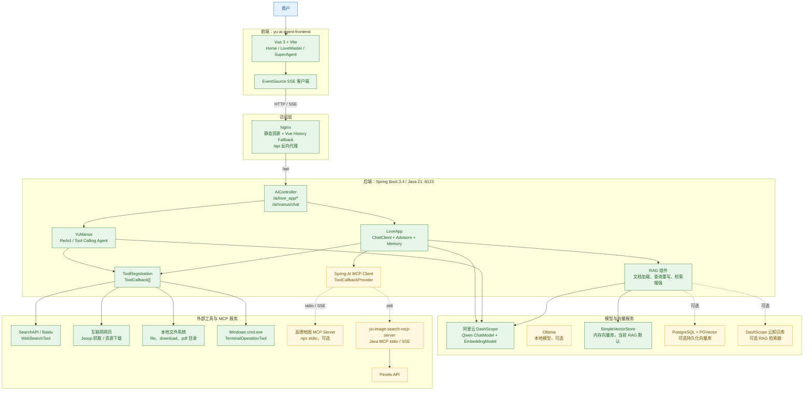
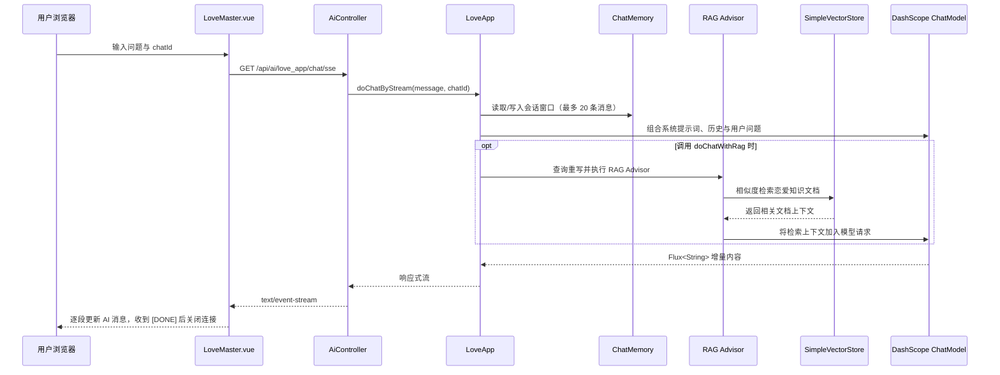
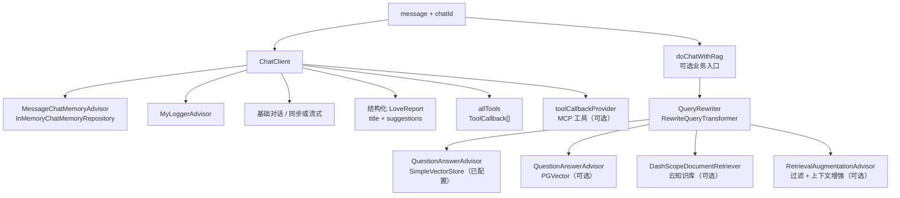
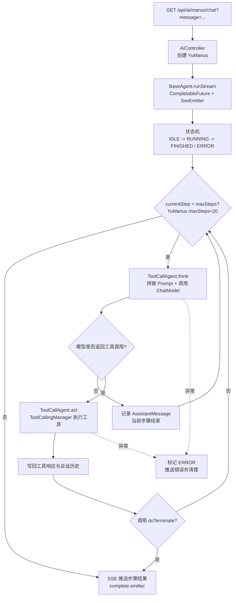
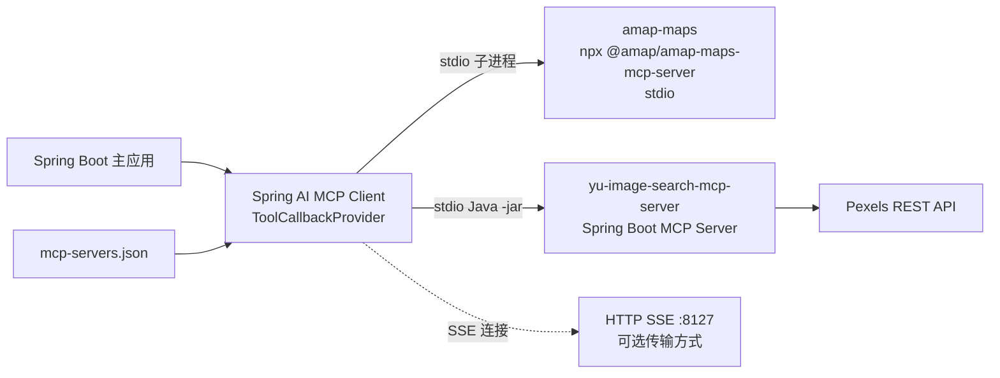
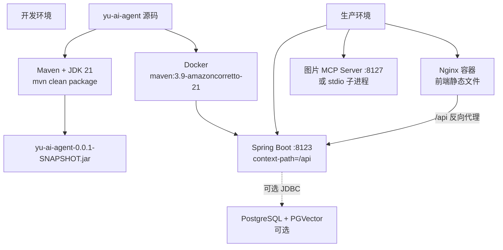

# yu-ai-agent 项目架构图

> 本文档基于仓库 `liyupi/yu-ai-agent` 的 `master` 分支（克隆提交：`6d4608c`）整理。
> 图中“当前启用”表示按仓库默认配置即可工作的路径；“可选”表示代码已提供，但需要取消注释或补充外部服务配置。

## 1. 总体架构



### 组件边界说明

| 区域 | 主要职责 | 关键实现 |
| --- | --- | --- |
| 前端 | 页面路由、聊天窗口、SSE 增量渲染 | `yu-ai-agent-frontend/src/views`、`src/api/index.js` |
| HTTP 接入 | 将同步/流式请求转发给应用服务 | `AiController`，应用上下文为 `/api` |
| 恋爱大师 | 多轮对话、结构化报告、RAG、工具/MCP 调用能力 | `LoveApp` |
| 超级智能体 | 面向复杂任务的自主规划和多步执行 | `YuManus`、`ReActAgent`、`ToolCallAgent` |
| 工具层 | 文件、搜索、网页、下载、终端、PDF、终止工具 | `ToolRegistration` + `ToolCallback[]` |
| RAG 层 | 文档加载、Embedding、向量检索、查询重写 | `src/main/java/.../rag` |
| MCP 层 | 将外部 MCP Server 暴露为 Spring AI 工具 | `mcp-servers.json`、MCP Client |

## 2. 后端模块关系

```mermaid
flowchart LR
    boot["GuoAIAgentApplication"]
    cfg["application.yml<br/>DashScope / Ollama / port / context-path"]
    api["AiController"]
    health["HealthController"]
    love["LoveApp"]
    agent["YuManus"]
    base["BaseAgent<br/>状态、步骤、消息上下文、SSE"]
    react["ReActAgent<br/>think -> act"]
    call["ToolCallAgent<br/>ToolCallingManager"]
    reg["ToolRegistration"]
    callback["ToolCallback[]"]
    advisor["MyLoggerAdvisor<br/>ReReadingAdvisor"]
    memory["MessageWindowChatMemory<br/>maxMessages=20"]
    rag["RAG package"]
    mcp["ToolCallbackProvider"]

    boot --> cfg
    boot --> api
    boot --> health
    api --> love
    api --> agent
    agent --> call
    call --> react
    react --> base
    call --> callback
    reg --> callback
    love --> memory
    love --> advisor
    love --> rag
    love --> callback
    love --> mcp
```

`PgVectorVectorStoreConfig`、`LoveAppRagCloudAdvisorConfig` 和 MCP Client 的部分配置在默认 `application.yml` 中处于注释状态，因此它们是可切换的部署能力，不是默认启动必需项。

## 3. AI 恋爱大师请求链路



### LoveApp 的能力开关



默认 RAG 初始化过程为：`classpath:document/*.md` -> `MarkdownDocumentReader` -> `MyKeywordEnricher` 补充关键词元数据 -> DashScope Embedding -> `SimpleVectorStore`。如需持久化，可启用 PostgreSQL/PGVector 配置并切换 `LoveApp` 中的 Advisor。

## 4. YuManus 超级智能体执行链路



超级智能体可调用的本地工具如下：

| 工具 | 外部副作用/数据源 |
| --- | --- |
| `FileOperationTool` | `tmp/file` 下读写文本 |
| `WebSearchTool` | SearchAPI 的百度搜索接口，取前 5 条结果 |
| `WebScrapingTool` | Jsoup 抓取网页 HTML |
| `ResourceDownloadTool` | 下载 URL 资源到 `tmp/download` |
| `TerminalOperationTool` | 通过 `cmd.exe /c` 执行命令 |
| `PDFGenerationTool` | iText 生成 PDF 到 `tmp/pdf` |
| `TerminateTool` | 返回“任务结束”，让 Agent 进入 `FINISHED` |

## 5. MCP 集成架构



`yu-image-search-mcp-server` 通过 `MethodToolCallbackProvider` 注册 `ImageSearchTool.searchImage`，调用 Pexels `/v1/search` 并返回中等尺寸图片 URL。主应用的 MCP 配置目前被注释，启用前需要：

1. 填入高德、Pexels、DashScope 等 API Key。
2. 构建图片 MCP 子模块，生成 `yu-image-search-mcp-server/target/*.jar`。
3. 在 `application.yml` 启用 stdio 配置，或启动 MCP Server 的 SSE 模式（默认端口 `8127`）并配置连接地址。

## 6. 部署与运行拓扑



### 关键运行配置

| 配置项 | 默认值/位置 | 影响 |
| --- | --- | --- |
| 后端端口 | `8123` | Spring Boot HTTP 服务 |
| 应用上下文 | `/api` | 所有后端 API 的前缀 |
| DashScope 模型 | `qwen-plus` | ChatModel 与 EmbeddingModel 来源 |
| Ollama | `http://localhost:11434`、`gemma3:1b` | 本地模型示例，当前业务链路未默认使用 |
| 恋爱知识文档 | `src/main/resources/document/*.md` | 启动时加载到内存向量库 |
| MCP 图片服务 | `8127`（SSE）或 stdio | 外部图片搜索工具 |
| 前端开发 API | `http://localhost:8123/api` | `yu-ai-agent-frontend/src/api/index.js` |

## 7. 代码定位索引

- 应用入口：`src/main/java/com/xiaoguo/guaiagent/GuoAIAgentApplication.java`
- HTTP 控制器：`src/main/java/com/xiaoguo/guaiagent/controller/AiController.java`
- 恋爱大师：`src/main/java/com/xiaoguo/guaiagent/app/LoveApp.java`
- 智能体基类：`src/main/java/com/xiaoguo/guaiagent/agent/`
- 工具注册与实现：`src/main/java/com/xiaoguo/guaiagent/tools/`
- RAG：`src/main/java/com/xiaoguo/guaiagent/rag/`
- MCP 配置：`src/main/resources/mcp-servers.json`
- 前端入口与请求封装：`yu-ai-agent-frontend/src/`
- 图片 MCP 服务：`yu-image-search-mcp-server/src/main/java/`
