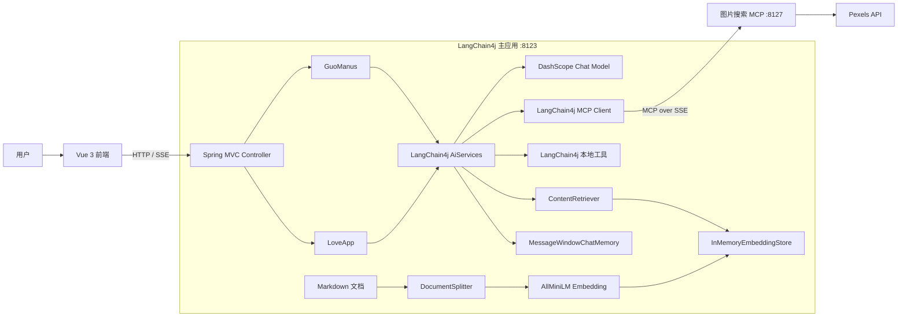
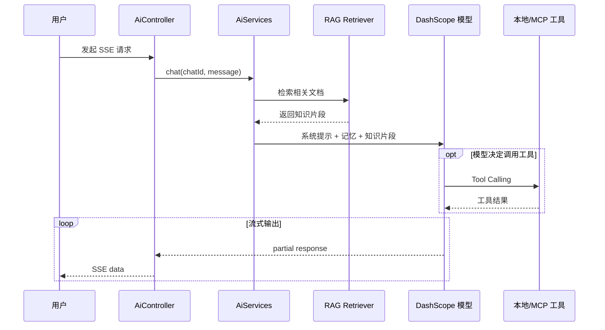
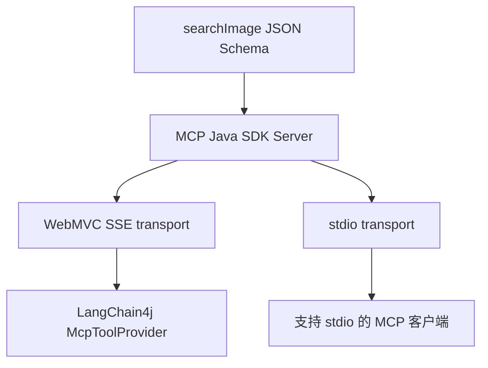

# 项目架构图

## 总体架构

```mermaid
flowchart LR
    User["用户"] --> Frontend["Vue 3 前端"]
    Frontend -->|"HTTP / SSE"| Controller["Spring MVC Controller"]

    subgraph Main["LangChain4j 主应用 :8123"]
        Controller --> Love["LoveApp"]
        Controller --> Manus["GuoManus"]
        Love --> Services["LangChain4j AiServices"]
        Manus --> Services
        Services --> Memory["MessageWindowChatMemory"]
        Services --> Rag["ContentRetriever"]
        Services --> Tools["LangChain4j 本地工具"]
        Services --> McpClient["LangChain4j MCP Client"]
        Services --> Model["DashScope Chat Model"]
        Rag --> Store["InMemoryEmbeddingStore"]
        Docs["Markdown 文档"] --> Splitter["DocumentSplitter"]
        Splitter --> Embed["AllMiniLM Embedding"]
        Embed --> Store
    end

    McpClient -->|"MCP over SSE"| ImageMcp["图片搜索 MCP :8127"]
    ImageMcp --> Pexels["Pexels API"]
```

## 请求链路

```mermaid
sequenceDiagram
    participant U as 用户
    participant C as AiController
    participant A as AiServices
    participant R as RAG Retriever
    participant M as DashScope 模型
    participant T as 本地/MCP 工具

    U->>C: 发起 SSE 请求
    C->>A: chat(chatId, message)
    A->>R: 检索相关文档
    R-->>A: 返回知识片段
    A->>M: 系统提示 + 记忆 + 知识片段
    opt 模型决定调用工具
        M->>T: Tool Calling
        T-->>M: 工具结果
    end
    loop 流式输出
        M-->>C: partial response
        C-->>U: SSE data
    end
```

## MCP 子模块

```mermaid
flowchart TB
    Tool["searchImage JSON Schema"] --> Server["MCP Java SDK Server"]
    Server --> Sse["WebMVC SSE transport"]
    Server --> Stdio["stdio transport"]
    Sse --> LangChain["LangChain4j McpToolProvider"]
    Stdio --> External["支持 stdio 的 MCP 客户端"]
```

主应用与 MCP 子模块均不依赖 Spring AI。Spring Boot 在两个模块中只承担 Web 容器、配置和 Bean 生命周期管理。
